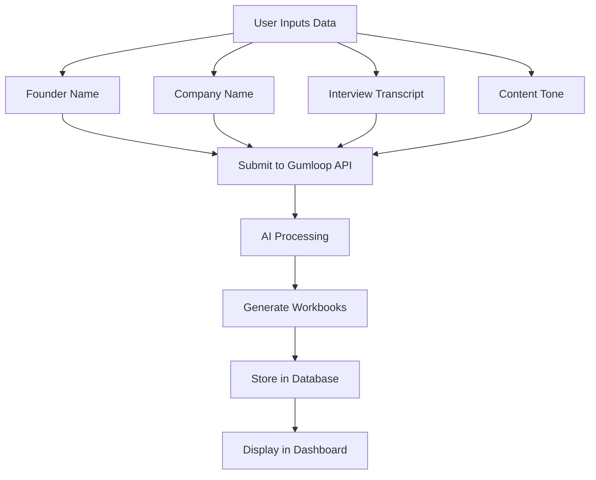
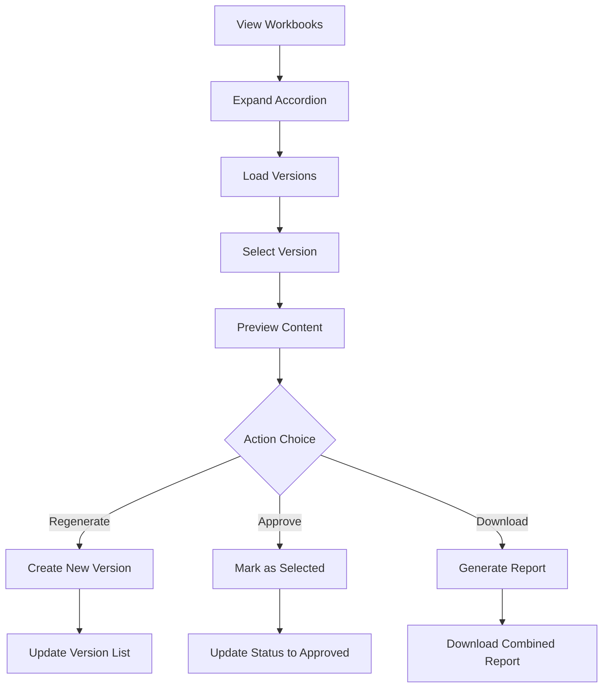

# Gumflow Automation Platform

A full-stack web application that automates the creation of working documents based on founder interviews and company information. Built with React, Node.js, and MongoDB, integrated with Gumloop AI for intelligent content generation.

## 🚀 Features

- **Automated Content Generation**: AI-powered workbook creation from interview transcripts
- **Version Management**: Multiple versions with selection and approval workflows
- **Real-time Status Tracking**: Live updates on automation progress
- **Download Reports**: Generate combined reports from selected workbook versions
- **User Authentication**: Secure login and registration system
- **Responsive Design**: Modern UI with Material-UI components

## 🏗️ Application Architecture

### System Overview
```
┌─────────────────┐    ┌─────────────────┐    ┌─────────────────┐
│   Frontend      │    │    Backend      │    │   External API  │
│   (React)       │◄──►│   (Node.js)     │◄──►│   (Gumloop)     │
│                 │    │                 │    │                 │
│ - React 18      │    │ - Express.js    │    │ - AI Processing │
│ - TypeScript    │    │ - MongoDB       │    │ - Pipeline Mgmt │
│ - Material-UI   │    │ - JWT Auth      │    │ - Content Gen   │
│ - Axios         │    │ - Mongoose      │    │                 │
└─────────────────┘    └─────────────────┘    └─────────────────┘
```

### Component Architecture
```
Frontend Structure:
├── src/
│   ├── components/
│   │   ├── WorkbooksAccordion.tsx    # Main workbook management
│   │   ├── Header.tsx                # Navigation header
│   │   └── Footer.tsx                # Page footer
│   ├── pages/
│   │   ├── ContentDashboard.tsx      # Main dashboard
│   │   ├── FlowList.tsx              # Flow listing
│   │   ├── Login.tsx                 # Authentication
│   │   └── Register.tsx              # User registration
│   ├── services/
│   │   └── apiService.js             # Centralized API calls
│   └── router.tsx                    # Route configuration

Backend Structure:
├── src/
│   ├── routes/
│   │   ├── flows.js                  # Flow management endpoints
│   │   ├── auth.js                   # Authentication routes
│   │   └── users.js                  # User management
│   ├── models/
│   │   ├── flow.js                   # Flow data model
│   │   └── user.js                   # User data model
│   ├── middlewares/
│   │   └── auth.js                   # JWT authentication
│   └── utils/
│       └── gumloopService.js         # Gumloop API integration
```

## 🔄 Business Case Flow

### 1. User Registration & Authentication
```
User → Register/Login → JWT Token → Access Dashboard
```

### 2. Flow Creation Process


### 3. Workbook Management Workflow


### 4. Data Flow
```
Frontend ←→ Backend API ←→ MongoDB (Data Storage)
                ↓
        Gumloop AI API (Content Generation)
```

## 📋 Prerequisites

- **Node.js** (v16 or higher)
- **npm** or **yarn**
- **MongoDB** (local or cloud instance)
- **Gumloop API Access** (API key required)

## 🛠️ Setup Instructions

### 1. Clone the Repository
```bash
git clone <repository-url>
cd gumflow-automation
```

### 2. Backend Setup

#### Navigate to backend directory
```bash
cd backend-node
```

#### Install dependencies
```bash
npm install
```

#### Create environment file
```bash
cp .env.example .env
```

#### Configure environment variables
Edit `.env` file with your configuration:
```env
# Gumloop API Configuration
GUMLOOP_API_KEY=your_gumloop_api_key_here
GUMLOOP_BASE_URL=https://api.gumloop.com/api/v1
GUMLOOP_USER_ID=your_gumloop_user_id
GUMLOOP_SAVED_ITEM_ID=your_saved_item_id

# Server Configuration
PORT=5000
NODE_ENV=development

# MongoDB Configuration
MONGODB_URI=mongodb://localhost:27017/gumflow-automation

# JWT Configuration
JWT_SECRET=your_super_secret_jwt_key_here

# CORS Configuration
CORS_ORIGIN=http://localhost:3000
```

#### Start MongoDB
Make sure MongoDB is running on your system:
```bash
# If using local MongoDB
mongod

# If using MongoDB service
sudo systemctl start mongod
```

#### Start the backend server
```bash
npm run dev
```

The backend will start on `http://localhost:5000`

### 3. Frontend Setup

#### Open new terminal and navigate to frontend directory
```bash
cd frontend
```

#### Install dependencies
```bash
npm install
```

#### Create environment file
```bash
cp .env.example .env
```

#### Configure environment variables
Edit `.env` file:
```env
# API Configuration
REACT_APP_API_BASE_URL=http://localhost:5000/api
REACT_APP_API_TIMEOUT=30000

# Environment
NODE_ENV=development

# App Configuration
REACT_APP_NAME=Gumflow Automation
REACT_APP_VERSION=1.0.0
```

#### Start the frontend development server
```bash
npm run dev
```

The frontend will start on `http://localhost:5173` (or next available port)

## 🎯 Usage Guide

### 1. Access the Application
Open your browser and navigate to the frontend URL (typically `http://localhost:5173`)

### 2. Create an Account
- Click "Register" to create a new account
- Fill in your details and submit
- Login with your credentials

### 3. Create a New Flow
- Click "Start New Gumflow Automation"
- Fill in the required information:
  - **Founder Name**: Name of the company founder
  - **Company Name**: Name of the company
  - **Interview Transcript**: Content to process
  - **Tone**: Style for content generation
- Submit the form

### 4. Monitor Flow Progress
- View real-time status updates
- Click refresh to check latest status
- Wait for completion

### 5. Manage Workbooks
- Expand workbook accordions to view versions
- Select different versions to preview content
- Use "Regenerate" to create new versions
- Use "Approve" to mark preferred versions
- Download combined reports

## 🔧 Development

### Backend Development
```bash
cd backend-node
npm run dev          # Start with nodemon for auto-reload
npm run start        # Start production server
npm run test         # Run tests (if configured)
```

### Frontend Development
```bash
cd frontend
npm run dev          # Start development server
npm run build        # Build for production
npm run preview      # Preview production build
npm run lint         # Run ESLint
```

## 📦 API Endpoints

### Authentication
- `POST /api/auth/register` - User registration
- `POST /api/auth/login` - User login

### Users
- `GET /api/users/me` - Get current user profile

### Flows
- `GET /api/flows` - Get user's flows
- `POST /api/flows/create` - Create new flow
- `GET /api/flows/:runId` - Get flow details
- `GET /api/flows/list-workbooks` - Get available workbooks
- `GET /api/flows/subflow-versions/:runId` - Get subflow versions
- `POST /api/flows/select-version` - Select workbook version
- `POST /api/flows/regenerate/:savedRunId` - Regenerate workbook
- `GET /api/flows/combined-report/:runId` - Get combined report

## 🧪 Testing

### Running Tests
```bash
# Backend tests
cd backend-node
npm test

# Frontend tests
cd frontend
npm test
```

### Manual Testing Checklist
- [ ] User registration and login
- [ ] Flow creation with valid data
- [ ] Workbook accordion expansion
- [ ] Version selection and preview
- [ ] Regeneration functionality
- [ ] Approval workflow
- [ ] Report download
- [ ] Error handling

## 🚀 Deployment

### Backend Deployment
1. Set production environment variables
2. Build the application (if using TypeScript)
3. Deploy to your preferred platform (Heroku, AWS, DigitalOcean, etc.)

### Frontend Deployment
1. Update API URLs in environment variables
2. Build the application: `npm run build`
3. Deploy the `dist` folder to static hosting (Netlify, Vercel, AWS S3, etc.)

## 🛡️ Security Considerations

- JWT tokens for authentication
- Environment variables for sensitive data
- Input validation on both frontend and backend
- CORS configuration for API access
- Rate limiting (recommended for production)

## 🐛 Troubleshooting

### Common Issues

1. **"Process is not defined" error**
   - Ensure environment variables are prefixed with `REACT_APP_`
   - Restart the development server after changing .env files

2. **MongoDB connection issues**
   - Check if MongoDB service is running
   - Verify connection string in environment variables

3. **Gumloop API errors**
   - Verify API key and user ID are correct
   - Check API rate limits and quotas

4. **Port conflicts**
   - Frontend/backend may start on different ports if default ones are in use
   - Check terminal output for actual URLs

### Debug Mode
Enable debug logging by setting:
```env
NODE_ENV=development
DEBUG=true
```

## 📝 Contributing

1. Fork the repository
2. Create a feature branch
3. Make your changes
4. Add tests if applicable
5. Submit a pull request

## 📄 License

This project is licensed under the MIT License - see the LICENSE file for details.

## 🤝 Support

For support and questions:
- Create an issue in the repository
- Check the troubleshooting section
- Review the API documentation

## 🗺️ Roadmap

### Upcoming Features
- [ ] User role management
- [ ] Workbook templates
- [ ] Advanced reporting analytics
- [ ] Email notifications
- [ ] API rate limiting
- [ ] Automated testing suite
- [ ] Performance monitoring
- [ ] Multi-language support

### Technical Improvements
- [ ] Migration to TypeScript backend
- [ ] Redis caching
- [ ] WebSocket real-time updates
- [ ] Docker containerization
- [ ] CI/CD pipeline
- [ ] Load balancing
- [ ] Database optimization